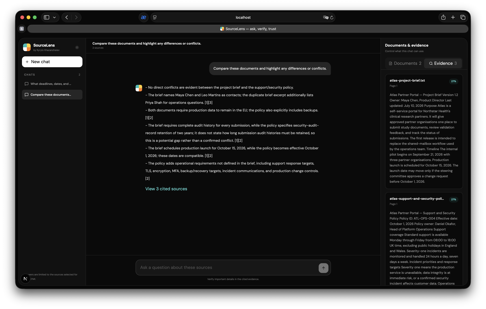
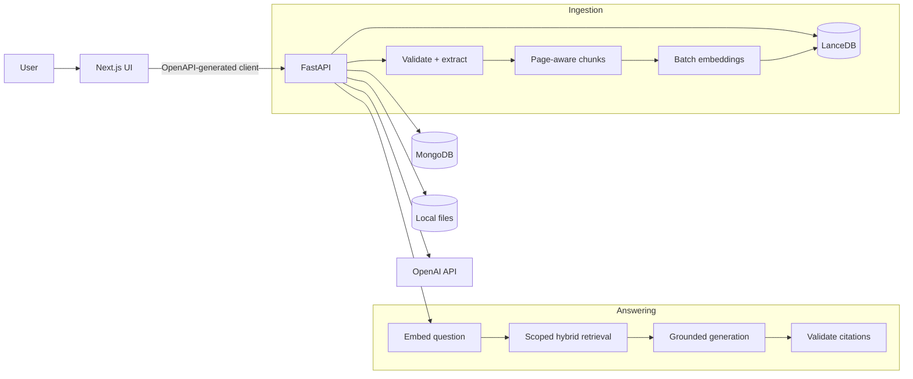
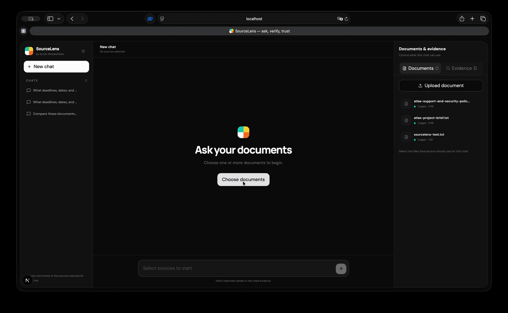
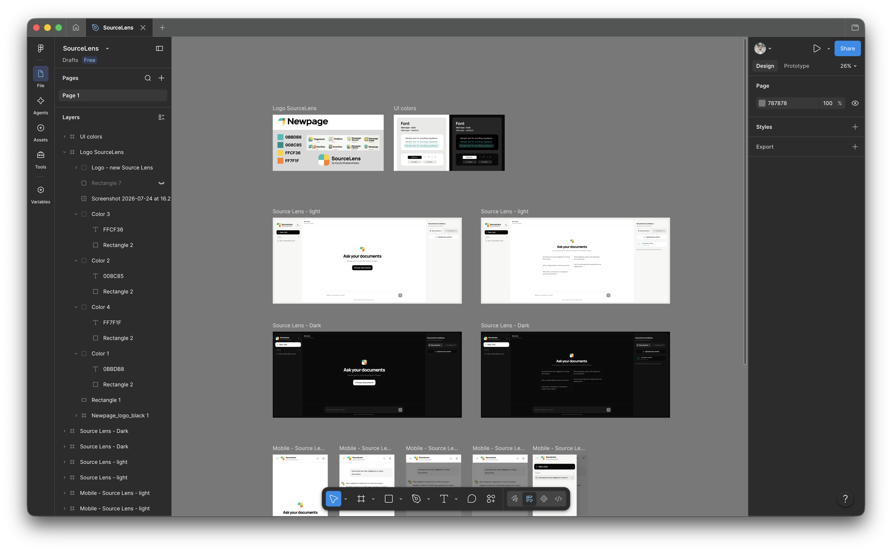

# SourceLens

> Grounded answers from your documents.

SourceLens is a RAG application I built for the Newpage Solutions Full Stack FDE
take-home assignment (Option 1: **Chat With Your Docs**). It lets a user upload PDF
or text documents, ask questions, and check the evidence behind each answer.

The main rule I wanted to keep clear was simple: if the selected documents do not
support an answer, SourceLens should say so.



## How to use SourceLens

SourceLens works like a normal document chat. The suggested questions are examples,
not commands, so the user can ask anything that the selected documents can answer.

Typical flow:

1. **Start a new chat.** A new chat begins as an unsaved draft.
2. **Choose the documents.** Select one or more ready documents in the right-hand
   Documents panel, or upload a new PDF/TXT file.
3. **Wait for indexing.** The input becomes available when the selected documents are
   ready.
4. **Ask a question.** Type a normal question such as “What is the production launch
   date?” or use one of the suggestion buttons.
5. **Receive a grounded answer.** SourceLens searches only the selected documents and
   generates an answer from the retrieved passages.
6. **Check the evidence.** Click an inline citation such as `[1]`, or open the
   Evidence panel to see the filename, page, excerpt, and source relevance. The
   original file can be opened directly from the citation.
7. **Continue the conversation.** Follow-up questions use the same fixed document
   scope. Start a new chat to use a different set of documents.
8. **Return later.** A chat is saved to MongoDB after its first question. Saved chats
   appear in the left sidebar and can be reopened with their messages and document
   scope.
9. **Delete when finished.** Use the trash action beside a chat to permanently remove
   that conversation and its messages. Uploaded documents remain available.

If the documents do not support the question, SourceLens does not try to fill in the
gaps. It returns one of two clear outcomes:

- **No relevant passage:** retrieval did not find a sufficiently similar excerpt. Try
  using terminology from the document or selecting a different source.
- **Insufficient support:** related excerpts were found, but they did not establish the
  requested fact confidently enough to answer.

### Adding and comparing documents

Start a new chat, open **Documents & evidence**, and upload or select the documents
that should form the chat context. To compare documents, select at least two sources
before asking a question such as:

`Compare these documents and highlight any differences or conflicts.`

The selected document set is fixed after the first question so that every follow-up
answer remains grounded in the same context. Start a new chat when you want to use a
different combination of documents.


### Included sample documents

The repository includes two fictional documents under [`docs/samples`](docs/samples):

- `atlas-project-brief.txt` — scope, timeline, responsibilities, budget, risks, and
  success measures for the Atlas Partner Portal.
- `atlas-support-and-security-policy.txt` — support hours, incident response targets,
  security controls, retention, backups, and escalation contacts.

The backend indexes missing sample documents at startup. Seeding is idempotent: files
that already exist are detected by SHA-256 and are not duplicated. Indexing requires a
valid `OPENAI_API_KEY`, because sample documents use the same embedding pipeline as
user uploads.

Useful demo questions:

- `When is Atlas scheduled to launch, and who recommends the final go-live?`
- `What are the response targets for severity-one and severity-two incidents?`
- `Which requirements apply to data location, backups, and retention?`
- `Compare the delivery responsibilities in the brief with the operational
  responsibilities in the policy.`
- `Does either document require electronic signatures?`
- `What is the cafeteria menu?` — demonstrates the grounded abstention behaviour.

## What it does

- Seed two ready-to-use sample documents without creating duplicates.
- Upload and validate PDF or UTF-8 TXT files up to 20 MB.
- Extract page-aware text and reject scanned/image-only PDFs with an actionable message.
- Chunk content with overlap and preserve document, page, and content-hash metadata.
- Create OpenAI embeddings in batches and persist them in LanceDB.
- Store documents, conversations, and messages in MongoDB.
- Restore saved conversations and their fixed document scope from the chat sidebar.
- Combine semantic and full-text retrieval with LanceDB's model-free RRF reranker.
- Keep retrieval inside the document scope selected for that conversation.
- Generate concise answers through the OpenAI Responses API using a strict JSON Schema.
- Validate model-returned source IDs before exposing citations.
- Abstain when retrieval or generation does not provide sufficient evidence.
- Show clickable citations, page numbers, excerpts, source relevance, and links to the
  original document.
- Handle loading, empty, error, and abstention states in a responsive interface.
- Expose OpenAPI, health checks, structured logs, and automated tests.

## Stack

| Layer         | Choice                                                    | Why                                                                               |
| ------------- | --------------------------------------------------------- | --------------------------------------------------------------------------------- |
| API           | FastAPI + Pydantic v2                                     | Explicit contracts, validation, OpenAPI generation                                |
| UI            | Next.js + TypeScript + Tailwind + shadcn-style primitives | Fast product iteration with a polished, accessible component model                |
| Server state  | TanStack Query                                            | Predictable async loading, invalidation, and mutation states                      |
| Typed client  | Hey API                                                   | Generates the frontend SDK from FastAPI's OpenAPI contract                        |
| Metadata      | MongoDB                                                   | Natural fit for evolving document, conversation, and citation records             |
| Retrieval     | LanceDB hybrid search                                     | Local vector + full-text search with model-free RRF reranking                      |
| LLM           | OpenAI Responses API, `gpt-5.6-terra`                     | Strong quality/cost balance; model remains configurable                           |
| Embeddings    | `text-embedding-3-small`                                  | Cost-effective default for semantic retrieval                                     |
| Runtime       | Docker Compose                                            | Repeatable local backend and database setup                                       |

## Architecture



FastAPI owns the contract. The frontend can regenerate its types and SDK with `make api-client`, preventing handwritten interfaces from drifting as the API evolves.

## Run locally

### Prerequisites

- Docker Desktop with Docker Compose
- Node.js 22+
- An OpenAI API key

### 1. Configure secrets

```bash
cp .env.example .env
```

Add your API key to `.env`:

```dotenv
OPENAI_API_KEY=your_key_here
```

Never commit `.env`.

### 2. Start the API and MongoDB

```bash
docker compose up --build mongodb backend
```

On the first successful start, the backend embeds and indexes the two sample documents.
The API is available at `http://localhost:8000`; interactive OpenAPI docs are at
`http://localhost:8000/docs`.

### 3. Start the frontend

In a second terminal:

```bash
cd frontend
npm install
npm run dev
```

Open `http://localhost:3000`.

## Demo flow



1. Open SourceLens and confirm that the two Atlas sample documents are ready.
2. Start a new chat and select both documents.
3. Ask when Atlas launches and who owns the final go-live recommendation.
4. Ask a follow-up question about incident response times.
5. Inspect the Evidence panel, then open one citation in the original document.
6. Ask about something absent, such as the cafeteria menu, and observe the explicit
   abstention.
7. Start another chat, then reopen the first one from the left sidebar.

## Design process

I used Figma to sketch the SourceLens logo, colour system, light and dark themes, and
the main desktop and mobile states before building the interface.
[Open the SourceLens design file in Figma](https://www.figma.com/design/pEYYaiqqtX8jUY4NgpmQqG/SourceLens).

[](https://www.figma.com/design/pEYYaiqqtX8jUY4NgpmQqG/SourceLens)

## Command reference

Run these commands from the repository root unless a different directory is shown.

### Project commands

| Command | Purpose |
| --- | --- |
| `make setup` | Create `.env` when missing, install backend dependencies, and install frontend dependencies. |
| `make backend` | Start MongoDB and the API in the foreground with Docker Compose. |
| `make frontend` | Start the Next.js development server. |
| `make up` | Start the Docker Compose services in the background. |
| `make down` | Stop Docker Compose services while preserving database volumes. |
| `make test` | Run backend tests and a production frontend build. |
| `make lint` | Run Ruff for Python and ESLint for the frontend. |
| `make openapi` | Generate `openapi.json` from the FastAPI application. |
| `make api-client` | Regenerate the typed frontend API client from the FastAPI contract. |

### Docker commands

| Command | Purpose |
| --- | --- |
| `docker compose up --build mongodb backend` | Build and start MongoDB and the API in the foreground. |
| `docker compose up -d --build` | Rebuild and start all Docker services in the background. |
| `docker compose ps` | Show service and health status. |
| `docker compose logs -f backend` | Follow API logs, including sample-document indexing. |
| `docker compose restart backend` | Restart the existing API image without rebuilding it. |
| `docker compose down` | Stop services without deleting stored documents or chats. |

Do not use `docker compose down -v` unless you intentionally want to delete the MongoDB
and LanceDB volumes.

### Frontend commands

Run these from `frontend/`:

| Command | Purpose |
| --- | --- |
| `npm install` | Install frontend dependencies. |
| `npm run dev` | Start the development server at `http://localhost:3000`. |
| `npm run build` | Run the production build and TypeScript validation. |
| `npm run start` | Serve a completed production build. |
| `npm run lint` | Run ESLint. |
| `npm run generate:api` | Generate the typed client after `openapi.json` has been created. |

### Backend commands

Run these from `backend/`:

| Command | Purpose |
| --- | --- |
| `uv sync` | Install backend and development dependencies. |
| `uv run pytest` | Run backend tests. |
| `uv run ruff check .` | Run Python lint checks. |
| `uv run uvicorn app.main:app --reload` | Run the API directly without Docker. MongoDB must already be available. |

## Troubleshooting

### The UI shows zero chats even though chats were created

Rebuild the API so it includes the conversation-list endpoint:

```bash
docker compose up -d --build backend
```

Restarting without `--build` can leave an older backend image running.

### The sample documents do not appear

1. Confirm that `OPENAI_API_KEY` is set in `.env`.
2. Rebuild and restart the backend.
3. Follow `docker compose logs -f backend`.
4. Wait for both files to finish embedding, then refresh the UI.

### A scanned PDF is rejected

The MVP extracts text but does not run OCR. Use a PDF with selectable text or upload a
UTF-8 TXT file.

## Retrieval and grounding design

1. The API validates the file, computes SHA-256, and deduplicates it.
2. PyMuPDF extracts text while retaining page boundaries.
3. Text is normalised and split into ~700-token-equivalent windows with overlap.
4. `text-embedding-3-small` embeds chunks in batches.
5. LanceDB stores vectors with document, page, chunk, and content-hash metadata.
6. Each question runs through both cosine vector search and full-text search, limited
   to the documents selected for that conversation.
7. LanceDB combines the two result lists with its model-free RRF reranker.
8. Candidates below the configured cosine relevance threshold are removed, and at
   most five excerpts are sent to the model.
9. Retrieved text is marked as untrusted data in the model instructions.
10. The Responses API returns `answer`, `cited_source_ids`, and
    `has_sufficient_evidence` under a strict JSON Schema.
11. The server discards unknown source IDs. If the evidence is not good enough, the
    draft answer is replaced with a deterministic abstention message.

I kept this as a direct RAG pipeline rather than adding an agent framework. There is
one retrieval step and one answer step, so an orchestration layer would add more code
without improving this flow. I would reconsider that choice if the product gained
branching tools, approval steps, repair loops, or multi-step research.

## API surface

| Method   | Endpoint                              | Purpose                                 |
| -------- | ------------------------------------- | --------------------------------------- |
| `GET`    | `/api/v1/health/live`                 | Process liveness                        |
| `GET`    | `/api/v1/health/ready`                | MongoDB, LanceDB, and API-key readiness |
| `POST`   | `/api/v1/documents`                   | Upload and index a document             |
| `GET`    | `/api/v1/documents`                   | List document states                    |
| `GET`    | `/api/v1/documents/{id}`              | Read document metadata                  |
| `GET`    | `/api/v1/documents/{id}/content`      | Open the original source file           |
| `DELETE` | `/api/v1/documents/{id}`              | Remove file, vectors, and metadata      |
| `GET`    | `/api/v1/conversations`               | List saved conversations                |
| `POST`   | `/api/v1/conversations`               | Create a document-scoped conversation   |
| `GET`    | `/api/v1/conversations/{id}`          | Read conversation and messages          |
| `DELETE` | `/api/v1/conversations/{id}`          | Delete a conversation and its messages  |
| `POST`   | `/api/v1/conversations/{id}/messages` | Retrieve, answer, and cite              |

## Quality checks

```bash
make test
make lint
```

The backend tests cover text extraction and chunking, hybrid retrieval and document
scoping, citation validation, original-file path safety, sample documents, and the API
contract. The frontend production build also runs TypeScript validation. The next
quality step is to turn the seed cases in `evals/questions.jsonl` into a runnable
evaluation with labelled relevant chunks and groundedness checks.

## Productionisation

I kept the local infrastructure small on purpose. For an AWS deployment, I would make
the following changes without changing the main API contracts:

- local uploads → private, versioned S3 objects with presigned upload URLs;
- local LanceDB path → LanceDB on S3 or a managed vector service after measured evaluation;
- MongoDB container → DynamoDB for serverless operation, or Atlas/DocumentDB if Mongo compatibility is valuable;
- inline ingestion → SQS-triggered worker with retries and a dead-letter queue;
- FastAPI container → App Runner/ECS, or Lambda with the Web Adapter for spiky workloads;
- local Next.js → Amplify Hosting;
- local secrets → Secrets Manager and KMS;
- local logs → structured CloudWatch/OpenTelemetry traces, metrics, alarms, and request correlation;
- manual delivery → GitHub Actions with OIDC, image scanning, IaC plan review, migrations, canaries, and rollback.

MongoDB should not run inside App Runner: a database is stateful, while App Runner instances are ephemeral and horizontally replaceable.

See [docs/productionization.md](docs/productionization.md) for the full reliability and security plan.

## Key decisions and trade-offs

- **PDF and TXT only:** I chose formats where I could preserve useful page-level
  evidence. OCR and more file types can come later.
- **Synchronous ingestion:** it keeps the local flow easy to run and understand. In
  production I would move ingestion to a queue and worker.
- **Hybrid retrieval without another model:** LanceDB combines cosine and full-text
  search with RRF. This improves exact-term lookup without adding a separate reranker
  service, although it still needs a proper evaluation set.
- **MongoDB plus LanceDB:** application state and retrieval data stay separate, at the
  cost of operating two stores.
- **Strict model output plus server validation:** this reduces invalid citations, but
  it does not replace groundedness evaluation. The UI calls the score `relevance`, not
  model confidence.
- **No authentication in the MVP:** I preferred to document the real production
  requirements instead of adding superficial security. A public version needs
  identity, tenant isolation, object-level authorisation, quotas, and audit events.

## AI-assisted development

I used AI to compare architecture options, speed up repetitive scaffolding, suggest
test cases, review code, and iterate on the interface. I did not treat generated output
as finished work: I read the changes, ran lint and tests, built the frontend, and
checked the important flows locally. I also kept API keys and production customer data
out of prompts.

The working rules I followed are recorded in
[docs/ai-assisted-development.md](docs/ai-assisted-development.md).

## With more time

- Retrieval evals with labelled relevant chunks, faithfulness checks, latency, and cost reporting.
- Markdown rendering for richer lists, headings, tables, links, and code blocks.
- Streaming answers with citation-safe finalisation.
- Background ingestion, progress polling, retries, and cancellation.
- OCR for scanned PDFs.
- Exact PDF text highlighting with PDF.js and stored text coordinates. Citations
  currently open the correct original file and page.
- Authentication, workspaces, audit trails, retention policies, and deletion jobs.
- Conversation rename, source-scope changes, and shareable read-only views.
- OpenTelemetry traces spanning ingestion, embedding, retrieval, and generation.
- CI/CD, dependency scanning, SBOM generation, Terraform, canary deploys, and rollback.

## Repository map

```text
backend/     FastAPI application, persistence adapters, RAG services, tests
frontend/    Next.js application and OpenAPI client generation config
evals/       Seed evaluation data and future evaluation runner
docs/        Architecture, production, and AI-development notes
```

## License

This repository is provided as a technical-assignment submission. No separate open-source licence is granted unless one is added explicitly.
