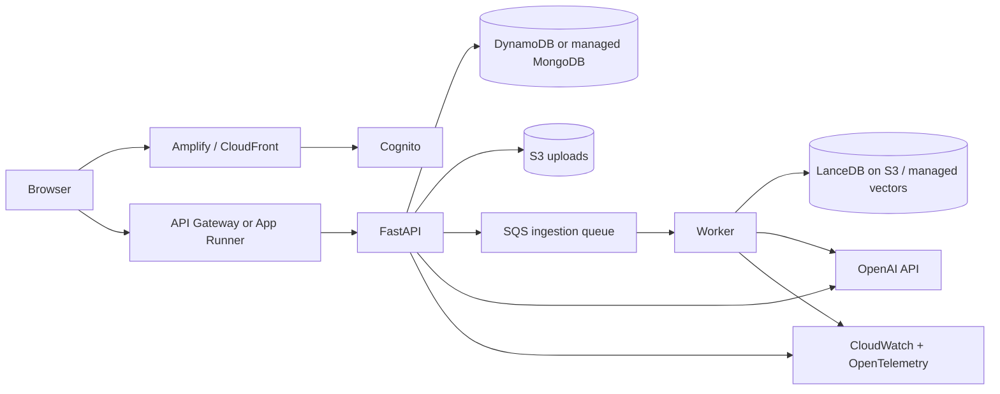

# Productionisation plan

## Target AWS shape

## Compute decision

- **App Runner/ECS:** simplest path for the current container and predictable FastAPI latency.
- **Lambda + Web Adapter:** attractive for low or bursty traffic; keep heavy ingestion outside request execution.
- **Worker:** an SQS consumer with visibility-timeout extension, bounded retries, and a dead-letter queue.

The decision should be based on expected traffic, cold-start tolerance, job duration, operational ownership, and cost modelling—not familiarity alone.

## Storage

- Upload directly to a private, versioned S3 bucket through short-lived presigned URLs.
- Record immutable object key, version, checksum, tenant ID, and lifecycle state.
- Use SSE-KMS, bucket public-access blocking, least-privilege access points, and lifecycle expiry.
- Keep LanceDB on S3 if its measured latency and concurrency meet the service-level objective. Otherwise compare managed vector services with the same evaluation corpus.
- Choose DynamoDB when access patterns are stable and serverless scale matters. Choose Atlas/DocumentDB when Mongo query compatibility and migration speed matter more.

## Reliability

- Idempotency keys for uploads and ingestion jobs.
- State-machine transitions guarded by conditional writes.
- Exponential backoff with jitter for transient provider errors.
- Separate retry policy for parse failures, model rate limits, and permanent validation failures.
- Dead-letter queue, replay tooling, and an operator-facing failure reason.
- Timeouts and concurrency limits around embeddings and generation.
- Graceful degradation: documents remain readable even if answering is temporarily unavailable.

## Security and privacy

- Cognito identity and workspace/tenant membership.
- Object-level authorisation on every document and conversation operation.
- Stable privacy-preserving OpenAI `safety_identifier` per signed-in user.
- Secrets Manager, KMS, IAM task roles, VPC endpoints where useful, WAF, rate limits, and abuse monitoring.
- Malware scanning before ingestion and strict parser isolation.
- Data classification, retention schedules, deletion workflows, audit events, and a documented subprocessor policy.
- Never log raw document text, prompts, answers, API keys, or presigned URLs by default.

## Observability and evaluation

Trace one correlation ID across upload, extraction, chunking, embedding, retrieval, generation, and response. Track:

- ingestion success/failure and duration;
- pages/chunks per file;
- embedding call count, tokens, latency, and cost;
- retrieval latency, candidate scores, and selected-context size;
- answer latency, model, token usage, cost, abstention rate, and citation count;
- queue age, retries, DLQ depth, and worker saturation.

CI runs deterministic unit/integration tests plus a small labelled RAG evaluation. Deployment gates should compare retrieval recall, answer faithfulness, abstention correctness, p95 latency, and cost against the previous accepted baseline.

## Delivery

Use Terraform or CDK, GitHub Actions with AWS OIDC, locked dependencies, secret scanning, SAST, dependency review, image scanning, SBOM generation, migration checks, canary health verification, and documented rollback. Production changes should require a reviewed plan and environment approval.
